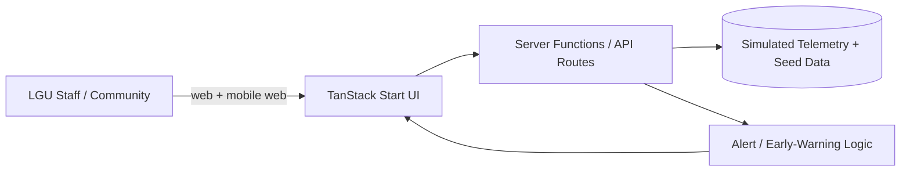

# Solution Architecture — Feasible by Design

Feasibility & Implementability is **40% of Level 1**. Design for a demo that runs reliably on the venue Wi-Fi with no external setup, then tell a credible deployment story.

Prerequisite: `docs/plan.md` from the `hackathon-kickoff` skill.

## Step 1 — Pick the smallest architecture that works

Default for this repo (already scaffolded in `frontend/`):

- **UI + server**: TanStack Start (React 19) with server functions and API routes — one app, one deploy.
- **Routing**: TanStack Router file-based routes in `frontend/src/routes/`.
- **Styling**: Tailwind CSS v4.
- **Data**: in-app simulated telemetry / JSON seed data. No database for Level 1 unless a judge-visible feature requires persistence.
- **Persistence (optional)**: only if login/registration is a judged feature; otherwise fake the session and prioritize the water features.

Do not add a separate backend service, message queue, or database "for realism" if it risks the demo. State the production path in the architecture doc instead.

## Step 2 — Draw the system diagram

Add a Mermaid diagram to `docs/architecture.md`:

Keep it to 5–8 boxes. Judges scan it in seconds.

## Step 3 — Define the data model

Write entities and fields in `docs/architecture.md`. Typical water-security entities:

- `WaterSource` — id, name, type (river/spring/groundwater/reservoir), location (lat/lng), barangay, capacity, status
- `WaterSystem` — id, name, level (I/II/III), coverage area, service hours, operator
- `ServiceStatus` — systemId, timestamp, availability, pressure/flow, quality flag, disruption reason
- `Household/Community` — id, location, population, access level, affordability indicator
- `Alert` — id, type (shortage/contamination/outage), severity, area, raisedAt, status
- `Report` — id, reporter, area, type, description, status, createdAt

Keep field names stable; the UI and the simulated generator both depend on them.

## Step 4 — Plan the API surface

List the server functions / API routes you will expose. Prefer a few coarse endpoints over many fine ones:

- `GET /api/status` — current service status per system/area
- `GET /api/alerts` — active and recent alerts
- `GET /api/sources` — water sources with status
- `POST /api/reports` — submit a community report
- `GET /api/metrics` — coverage, reliability, affordability indicators

Each must have a fallback path if the network is down (return bundled seed data).

## Step 5 — Design simulated data

You may use simulated data, but it must look plausible:

- Generate realistic values with daily/seasonal variation and occasional disruptions (typhoon, drought, contamination).
- Cover at least 3–5 barangays/systems across Region VIII so the map and dashboards are not empty.
- Include one "good" area and one "underserved" area to make inequity visible — this is the challenge's core theme.
- Deterministic seed so the demo looks the same on every run; add a manual "simulate disruption" control for the live demo.

See the `water-domain-data` skill for implementation details.

## Step 6 — Make the feasibility argument explicit

Add a `## Feasibility` section to `docs/architecture.md` answering:

- **Data**: where real data would come from (LGU records, existing flow meters, PAGASA/DOST feeds) and how the app degrades to manual entry.
- **Infrastructure**: runs on a basic LGU laptop/server or free hosting; no special hardware.
- **Skills**: an LGU IT staffer can operate it; document a one-paragraph runbook.
- **Cost**: near-zero for the prototype; list any paid production services.

## Step 7 — Make the scalability argument explicit

Add a `## Scalability` section:

- Multi-LGU: data is scoped by LGU/barangay, so new LGUs are added as records, not forks.
- Modular features: status, alerts, reports can be adopted independently.
- Offline/low-bandwidth: mobile-first, works on 3G; consider a read-only cached view.
- Maintenance: standard web stack, documented data model, no exotic dependencies.

## Step 8 — Outputs

- `docs/architecture.md` — diagram, entities, API surface, feasibility, scalability
- Data contracts that `water-domain-data` will implement

## Done when

- [ ] Diagram fits in 5–8 boxes
- [ ] Entities and fields are listed and stable
- [ ] API surface is listed with network-down fallbacks
- [ ] Simulated data covers good + underserved areas
- [ ] `## Feasibility` and `## Scalability` sections exist and cite concrete LGU context
