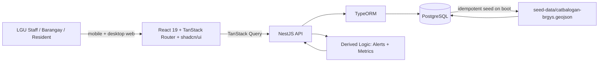

# WellPoint — Solution Architecture

Companion to `docs/plan.md`. This document defines the system shape, the technology choices and why, the data contracts, the derived logic, and the feasibility/scalability arguments judges will probe. For personas/access control and the end-to-end data flows, see `docs/system-design.md`.

---

## 1. Architecture decision

**WellPoint is a full-stack web app: a NestJS 11 API backed by PostgreSQL (TypeORM) in `backend/`, and a React 19 + TanStack Router SPA with shadcn/ui in `frontend/`, connected by TanStack Query and validated end-to-end with Zod.**

Both halves are already scaffolded (`backend/` is a NestJS app, `frontend/` is a TanStack Router SPA). We build a **working prototype**, not a static demo:

- The prototype must demonstrate real functionality: community reports that persist, status/alerts derived server-side, and the actual 57-barangay boundaries of Catbalogan City imported from `seed-data/catbalogan-brgys.geojson`.
- Feasibility & Implementability is **40%** of Level 1. We protect it by keeping the system small and locally runnable: Postgres + API + UI start with one Docker Compose command, and the DB is seeded deterministically on boot — no external services, no API keys, nothing that depends on venue Wi-Fi.
- The stack is the standard LGU-IT-friendly combo (NestJS, Postgres, React, TypeScript), so judges see a realistic production shape rather than a throwaway static page.

The trade-off — a real database and server add setup steps — is neutralized by Docker Compose and an idempotent seeder that guarantees a clean, identical state before every demo.

---

## 2. System diagram



One flow, two halves. **Postgres is the single source of truth.** On boot an idempotent seeder imports the 57 real barangay polygons plus the deterministic water dataset. The NestJS API derives alerts and metrics (§5) and serves them to the SPA through TanStack Query; mutations (community reports, simulate/reset demo) go back through the API to the DB.

> **Production swap:** keep the same entities and API contract; replace the deterministic seeder with scheduled telemetry ingest (flow meters, PAGASA/DOST feeds) and add multi-LGU scoping + auth. The UI is unchanged.

---

## 3. Technology choices

| Layer | Choice | Rationale |
| :--- | :--- | :--- |
| Frontend framework | React 19 + TanStack Router | Already scaffolded; file-based, type-safe routes. |
| Frontend UI | shadcn/ui (Tailwind CSS v4 + Radix) | Accessible, polished components; no heavy UI library. |
| Server state | TanStack Query | Caching, loading/error states, invalidation for API data. |
| Build tool | Vite 8 | Dev server on port 3000; small production bundle. |
| Backend | NestJS 11 | Already scaffolded; modular; realistic for LGU adoption. |
| ORM | TypeORM | Entities mirror the domain model; Postgres relations out of the box. |
| Database | PostgreSQL | Real persistence for reports, status samples, barangay records. |
| Validation | Zod (shared schemas) | One contract enforced on both API and UI; no silent shape drift. |
| Language | TypeScript (strict, both apps) | One typed contract across entities, API, and UI. |
| Mapping | Inline SVG projection of the GeoJSON served by the API | Real PSGC-coded polygons; no tiles, no keys. |
| Simulation | Pure functions + seeded RNG (`mulberry32`) in a NestJS service | Deterministic, testable, side-effect free. |
| Lint/format | ESLint + Prettier (both apps) | Green builds in `frontend/` and `backend/` are a submission requirement. |
| Local run / deploy | Docker Compose (Postgres + API + UI) → single VPS / LGU server | One command start; near-zero cost; one box to maintain. |

**Explicitly rejected:** a chart library (bundle size), a map tile provider (needs network + keys; the coverage map renders the GeoJSON to SVG client-side), a full auth/roles system (single-tenant prototype), a second database, and an event queue.

---

## 4. Data model

The domain model is defined once as **TypeORM entities in `backend/src/`**, mirrored as **Zod schemas** (the API boundary) and **frontend types** (`frontend/src/data/types.ts`). Field names are stable — entities, seed, API, and UI all depend on them.

```ts
type WaterSource = {
  id: string
  name: string
  type: 'river' | 'spring' | 'groundwater' | 'reservoir'
  lat: number
  lng: number
  barangayId: string            // FK → Community
  capacity: number              // m3/day, nominal
  status: 'ok' | 'low' | 'contaminated' | 'offline'
}

type WaterSystem = {
  id: string
  name: string
  level: 'I' | 'II' | 'III'   // service level
  coverageArea: string
  serviceHours: number
  operator: string
  sourceIds: string[]
}

type ServiceStatus = {
  systemId: string
  timestamp: string
  available: boolean
  flow: number                // % of nominal (0–100+)
  quality: 'safe' | 'advisory' | 'unsafe'
  reason?: 'drought' | 'typhoon' | 'maintenance' | 'contamination'
}

type Community = {
  id: string
  name: string               // barangay
  psgcCode: string           // PSGC code, matches the GeoJSON property
  areaSqKm: number           // from the GeoJSON properties (AREA_SQKM)
  boundary: GeoJSONPolygon   // imported polygon, served to the UI for SVG rendering
  distanceToCenterKm: number // computed from the polygon centroid (Poblacion cluster)
  population: number
  affordability: number      // 0–100, higher = more affordable (input signal)
  lat: number                // centroid of the polygon
  lng: number
  systemId: string
  // accessState and vulnerabilityTier are NOT stored — they are derived (§5).
}

type CommunityReport = {
  id: string
  reporter: string
  area: string
  type: 'no_water' | 'low_pressure' | 'contamination' | 'infrastructure_damage' | 'other'
  description: string
  status: 'new' | 'acknowledged' | 'resolved'
  createdAt: string
}

type Alert = {
  id: string
  type: 'shortage' | 'contamination' | 'outage'
  severity: 'info' | 'warning' | 'critical'
  area: string
  systemId?: string
  reportId?: string
  raisedAt: string
  status: 'active' | 'resolved'
  reason?: string
  message: string
  action: string             // recommended next step, plain language
}
```

### Entity relationships

- One `Community` (barangay) → one `WaterSystem`; a system → many `WaterSource`s.
- One `WaterSystem` → many `ServiceStatus` samples (one row per tick, so trends are queryable).
- `Alert`s are **derived** server-side from `ServiceStatus`, `WaterSource`, `CommunityReport`, and the barangay's computed vulnerability — not hand-entered.
- `CommunityReport`s are user-created records **persisted in Postgres** and joined to barangays by PSGC code.
- `accessState` and `vulnerabilityTier` are **derived read-model values** (§5) — never stored or seeded, which keeps the metric non-circular.

### Seed coverage

On boot, an **idempotent seeder** imports all **57 barangay polygons of Catbalogan City** from `seed-data/catbalogan-brgys.geojson` (PSGC-coded features with `AREA_SQKM`; bbox ≈ lon 124.67–124.97, lat 11.69–11.91) into Postgres. Each polygon's area and centroid distance from the Poblacion cluster feed the vulnerability computation. Water-service inputs are simulated for a curated five-barangay pilot — one well-served, one partial, one limited, one underserved, and one critical — so inequity is visible on the first screen. See `backend/src/db/seed/`. Boundaries are real; water-source coordinates and all water/service inputs are simulated and illustrative.

| Barangay (pilot subset) | Service level | Inputs (simulated) | Initial derived state |
| :--- | :-: | :-: | :--- |
| Poblacion 1 | III | high affordability, low isolation | **secure** |
| San Andres | II | medium affordability | watch |
| Mercedes | II | medium affordability, maintenance event | watch |
| Bangon | I | low affordability, high isolation | watch |
| Canlapwas | I | low affordability, high isolation | **critical** (contamination → outage) |

---

## 5. Derived logic (explainable, not black-box)

### 5.1 Early-warning alert rules — `backend/src/alerts/alerts.service.ts`

| Condition | Alert | Severity |
| :--- | :--- | :--- |
| `available === false` | outage | critical |
| `quality === 'unsafe'` | contamination | critical |
| `quality === 'advisory'` | contamination | warning |
| `flow < 25` | shortage | critical |
| `flow < 40` | shortage | warning |
| flow declining over the last 3 ticks **and** `flow < 60` | shortage (early warning) | warning |
| flow declining **and** vulnerability tier high | shortage (early warning, elevated impact) | critical |
| source `contaminated` | contamination | warning |
| source `offline` | outage | warning |
| source `low` | shortage | info |
| report `new` + contamination | contamination | warning |
| report `new` + no_water / infrastructure_damage | outage | warning |
| outage/contamination **and** vulnerability tier high | same alert, **priority response** | critical |

Each alert carries a plain-language `message`, a recommended `action` (e.g., "Deploy emergency water to Barangay Canlapwas within 6 hours"), and — for vulnerable barangays — an **impact note** tying the disruption to livelihoods (e.g., "threatens fishing/farming income"). Thresholds are small, documented, and shown in the UI — judges value transparency over a hidden score. Response priority is severity-weighted and underserved-first: same severity, isolated/low-affordability barangays are served first.

### 5.2 Water-security metrics — `backend/src/metrics/metrics.service.ts`

All access metrics are **derived from current signals, never stored or seeded**, so the score cannot be gamed by its own labels:

- **Access coverage %** = population with a *derived* access state of full or partial ÷ total population. A barangay counts as full-access only if its system is available, flow ≥ 40, quality is safe, and affordability is not low — *covered ≠ accessed*.
- **Reliability %** = mean of each system's `flow` (unavailable systems count as 0), so outages visibly hurt the score.
- **Affordability** = population-weighted affordability index (0–100).
- **Active alerts** = count of active derived alerts.
- **Water-security score (0–100)** = `0.4·access coverage + 0.3·reliability + 0.3·affordability − penalty`, where `penalty = min(30, 10·critical + 4·warning + 1·info)`.
- **Status band:** ≥ 75 **Secure** (green), 50–74 **Watch** (amber), < 50 **Critical** (red).

The composite score drives the dashboard banner; the components drive the KPI cards, so the user can always see *why* the score is what it is. Both rules and metrics run **server-side in NestJS services** and reach the UI as read-model DTOs — the browser never re-implements scoring.

### 5.3 Structural vulnerability — `backend/src/vulnerability/vulnerability.service.ts`

Vulnerability makes the real GeoJSON *do work*: it is the forward-looking half of the early warning. For each of the 57 barangays, computed from polygon geometry + service inputs:

- `isolation (0–1)` = `0.5·min(1, areaSqKm / 10) + 0.5·min(1, distanceToCenterKm / 15)` — larger, farther-from-city-center barangays (the "geographically isolated" language of the challenge) score higher.
- `structural vulnerability (low / medium / high)` = isolation + service level (`I` is riskiest) + source capacity margin. All inputs and thresholds are documented and shown in the drill-down.
- **Use:** weights alert severity (5.1), elevates response priority, and powers the impact note. Because it combines *static* geography with *live* trend, an alert can fire *before* a failure fully hits — the explainable "early warning" claim, not a black box.

---

## 6. Data access contract

The NestJS API exposes the contract below; the SPA consumes it with **TanStack Query hooks** (`frontend/src/data/`), and every request/response is validated with **Zod schemas** shared with the backend.

| Endpoint | Returns | Notes |
| :--- | :--- | :--- |
| `GET /api/status` | `ServiceStatus[]` | latest status per system (read model) |
| `GET /api/alerts` | `Alert[]` | derived by `alerts.service` |
| `GET /api/sources` | `WaterSource[]` | source health incl. per-barangay joins |
| `GET /api/barangays` | `Community[]` | 57 records incl. `boundary` polygons for the SVG map + derived access state & vulnerability tier |
| `GET /api/barangays/:id` | `BarangayDetail` | drill-down: trend, vulnerability breakdown, open reports, alerts |
| `GET /api/metrics` | `Metrics` | derived by `metrics.service` |
| `POST /api/reports` | `CommunityReport` | Zod-validated, persisted to Postgres, re-derives alerts |
| `POST /api/demo/simulate` | `void` | applies a disruption to system status samples |
| `POST /api/demo/reset` | `void` | re-runs the idempotent seeder for a clean state |

TanStack Query handles caching and invalidation: after a mutation (report, simulate, reset), the affected queries are re-fetched automatically. If the API is unreachable, queries surface an explicit retry/error state instead of silently rendering stale data.

---

## 7. Production path (documented, not built)

- **Data sources:** LGU water-office records and existing flow meters / service logs; PAGASA rainfall and DOST hazard feeds; barangay reports. Where telemetry is absent, staff enter data manually through the same API forms.
- **Telemetry:** a scheduled ingest job (NestJS `@nestjs/schedule` or an external scheduler) writes `ServiceStatus` samples from meters/PAGASA/DOST; the existing §5 rules keep running server-side.
- **Scoping & auth:** add multi-LGU tenancy on entities and a real auth/roles module; the API contract and UI stay unchanged.
- **Deploy:** the Docker Compose topology already matches a single production VPS/LGU server — scale out the API and Postgres as records grow.

---

## 8. Feasibility

- **Data:** the prototype ships with real PSGC-coded barangay boundaries for all 57 Catbalogan City barangays (`seed-data/catbalogan-brgys.geojson`), imported by an idempotent seeder; water data is deterministic simulated data. Real water data would come from LGU records, existing meters, and PAGASA/DOST; manual entry is the fallback and is already part of the API.
- **Infrastructure:** Docker Compose runs Postgres + API + UI locally; production is a single VPS or LGU server. No special hardware, no GPU, no external service, no API keys. **Venue day:** images are pulled once beforehand, so `docker compose up` runs the demo without venue Wi-Fi.
- **Skills:** standard tools (NestJS, TypeORM, Postgres, React, TypeScript) — the same stack many LGU IT vendors already use. Runbook: `docker compose up`; press **Reset demo** before a presentation.
- **Cost:** near PHP 0 locally (free Docker/Postgres licenses); ~PHP 500–1,500/month for a small VPS if hosted. No paid APIs used in the prototype.

---

## 9. Scalability & sustainability

- **Multi-LGU:** every record is scoped by LGU/barangay; adding a new LGU means adding seed/DB records plus that LGU's own GeoJSON boundaries (same import pipeline), not forking the app.
- **Modular features:** dashboard, coverage, alerts, and reports are independent modules/routes and can be adopted one at a time.
- **Low bandwidth / mobile:** lightweight SPA, mobile-first, works on 3G; no map tiles or third-party scripts.
- **Maintenance:** standard web stack, typed entities, Zod-validated boundaries, pure simulation functions. A new developer can read the data model in one file per app.
- **Open-source attribution:** see `docs/submission.md` (all dependencies are MIT/Apache/BSD; PostgreSQL is open-source; no external data APIs are called at runtime).

---

## 10. Non-functional requirements

- **Determinism:** the seeder is deterministic (`baseSeed = 20261006`); every boot produces identical state until the presenter triggers a disruption.
- **Accessibility:** semantic HTML, labeled inputs, status conveyed by icon **and** text (never color alone), tap targets ≥ 44px, WCAG AA contrast.
- **Robustness:** `docker compose up` gives a fresh, known-good state; one active critical alert and one resolved alert are seeded; `Reset demo` re-seeds through the API.
- **Performance:** SVG map from GeoJSON and small API payloads keep first paint fast; no chart or tile dependency.
