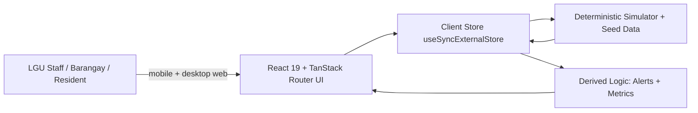

# WellPoint — Solution Architecture

Companion to `docs/plan.md`. This document defines the system shape, the technology choices and why, the data contracts, the derived logic, and the feasibility/scalability arguments judges will probe.

---

## 1. Architecture decision

**WellPoint is a single, client-only web app: React 19 + TanStack Router (file-based routes), built by Vite, styled with Tailwind CSS v4.**

The scaffold in `frontend/` is a **TanStack Router SPA** — there is **no `@tanstack/react-start` and no server runtime installed** (`package.json`, `vite.config.ts`). We deliberately keep it that way:

- The hackathon requires a prototype that **renders with no network and no database**. A static SPA with bundled seed data is the most reliable possible demo — it cannot fail on venue Wi-Fi.
- Feasibility & Implementability is **40%** of Level 1. Every extra moving part (server, DB, queue, map tiles, API keys) is a way for the live demo to break.
- The same build deploys to any static host or runs on an LGU laptop with no install.

The one trade-off — no server-side persistence — is acceptable because reports and demo state are session-scoped for the prototype. The **production path** (thin API + PostgreSQL, fed by flow meters and PAGASA/DOST) is documented in §7 and reuses the exact same contracts, so no UI change is needed to adopt it.

---

## 2. System diagram



Six boxes, one flow. The store is the single source of truth; the simulator mutates it; derived logic (alerts, metrics) is computed from it; the UI subscribes to it.

> **Production swap:** replace the `Client Store → Simulator/Seed` edge with `Client Store → HTTP API → PostgreSQL + telemetry feeds`. `Derived Logic` and the whole UI are unchanged.

---

## 3. Technology choices

| Layer | Choice | Rationale |
| :--- | :--- | :--- |
| UI framework | React 19 + TanStack Router | Already scaffolded; file-based, type-safe routes; no server needed. |
| Build tool | Vite 8 | Dev server on port 3000; static production output. |
| Language | TypeScript 6 (strict) | One typed contract shared by seed, simulator, store, and UI. |
| Styling | Tailwind CSS v4 (`@tailwindcss/vite`) | Mobile-first, no heavy component library, small bundle. |
| State | `useSyncExternalStore` + a module store | Built into React; zero dependencies; shared live state across routes. |
| Simulation | Pure functions + seeded RNG (`mulberry32`) | Deterministic, testable, side-effect free. |
| Charts | Inline SVG sparkline component | No chart dependency; instant first paint; offline. |
| Lint/format | ESLint (`@tanstack/eslint-config`) + Prettier | Required by the repo and by submission QA. |
| Deploy | Static host / LGU laptop | No server, near-zero cost. |

**Explicitly rejected:** a chart library (bundle size), a map tile provider (needs network + keys), a component library (build time, unused weight), a database (setup risk, not judged for the prototype).

---

## 4. Data model

Types live in `frontend/src/data/types.ts`. Field names are stable — the seed, the simulator, and the UI all depend on them.

```ts
type WaterSource = {
  id: string
  name: string
  type: 'river' | 'spring' | 'groundwater' | 'reservoir'
  lat: number
  lng: number
  barangay: string
  capacity: number          // m3/day, nominal
  status: 'ok' | 'low' | 'contaminated' | 'offline'
}

type WaterSystem = {
  id: string
  name: string
  level: 'I' | 'II' | 'III'   // service level
  coverageArea: string
  serviceHours: number
  operator: string
  sourceIds: string[]
}

type ServiceStatus = {
  systemId: string
  timestamp: string
  available: boolean
  flow: number                // % of nominal (0–100+)
  quality: 'safe' | 'advisory' | 'unsafe'
  reason?: 'drought' | 'typhoon' | 'maintenance' | 'contamination'
}

type Community = {
  id: string
  name: string               // barangay
  population: number
  accessLevel: 'full' | 'partial' | 'limited'
  affordability: number      // 0–100, higher = more affordable
  lat: number
  lng: number
  systemId: string
}

type CommunityReport = {
  id: string
  reporter: string
  area: string
  type: 'no_water' | 'low_pressure' | 'contamination' | 'infrastructure_damage' | 'other'
  description: string
  status: 'new' | 'acknowledged' | 'resolved'
  createdAt: string
}

type Alert = {
  id: string
  type: 'shortage' | 'contamination' | 'outage'
  severity: 'info' | 'warning' | 'critical'
  area: string
  systemId?: string
  reportId?: string
  raisedAt: string
  status: 'active' | 'resolved'
  reason?: string
  message: string
  action: string             // recommended next step, plain language
}
```

### Entity relationships

- One `Community` (barangay) → one `WaterSystem`; a system → many `WaterSource`s.
- One `WaterSystem` → one current `ServiceStatus`.
- `Alert`s are **derived** from `ServiceStatus`, `WaterSource`, and `CommunityReport` — not hand-entered.
- `CommunityReport`s are the only user-created records; they are session-scoped in the prototype.

### Seed coverage

Five barangays across Catbalogan City, Samar — one well-served, one partial, one limited, one underserved, and one critical — so inequity is visible on the first screen. See `frontend/src/data/seed.ts`. Coordinates are illustrative (Region VIII / Catbalogan City area).

| Barangay | Service level | Access | Affordability | Initial condition |
| :--- | :-: | :-: | :-: | :--- |
| Poblacion | III | full | high | secure |
| San Andres | II | partial | medium | watch |
| Mercedes | II | partial | medium | watch (maintenance) |
| Bangon | I | limited | low | watch |
| Canlapwas | I | limited | low | **critical** (contamination → outage) |

---

## 5. Derived logic (explainable, not black-box)

### 5.1 Early-warning alert rules — `frontend/src/lib/alerts.ts`

| Condition | Alert | Severity |
| :--- | :--- | :--- |
| `available === false` | outage | critical |
| `quality === 'unsafe'` | contamination | critical |
| `quality === 'advisory'` | contamination | warning |
| `flow < 25` | shortage | critical |
| `flow < 40` | shortage | warning |
| flow declining over the last 3 ticks **and** `flow < 60` | shortage (predictive) | warning |
| source `contaminated` | contamination | warning |
| source `offline` | outage | warning |
| source `low` | shortage | info |
| report `new` + contamination | contamination | warning |
| report `new` + no_water / infrastructure_damage | outage | warning |

Each alert carries a plain-language `message` and a recommended `action` (e.g., "Deploy emergency water to Barangay Canlapwas within 6 hours"). Thresholds are small, documented, and shown in the UI — judges value transparency over a hidden score.

### 5.2 Water-security metrics — `frontend/src/lib/metrics.ts`

- **Coverage %** = population with at least partial service ÷ total population.
- **Reliability %** = mean of each system's `flow` (unavailable systems count as 0), so outages visibly hurt the score.
- **Affordability** = population-weighted affordability index (0–100).
- **Active alerts** = count of active derived alerts.
- **Water-security score (0–100)** = `0.4·coverage + 0.3·reliability + 0.3·affordability − penalty`, where `penalty = min(30, 10·critical + 4·warning + 1·info)`.
- **Status band:** ≥ 75 **Secure** (green), 50–74 **Watch** (amber), < 50 **Critical** (red).

The composite score drives the dashboard banner; the components drive the KPI cards, so the user can always see *why* the score is what it is.

---

## 6. Data access contract

The prototype implements the future API surface as local async accessors in `frontend/src/data/api.ts`, so a real backend can replace it without touching the UI.

| Contract | Returns | Prototype behavior | Network-down fallback |
| :--- | :--- | :--- | :--- |
| `GET /api/status` | `ServiceStatus[]` | reads the store | bundled seed |
| `GET /api/alerts` | `Alert[]` | derived from store | bundled seed |
| `GET /api/sources` | `WaterSource[]` | reads the store | bundled seed |
| `GET /api/metrics` | `Metrics` | derived from store | computed from seed |
| `POST /api/reports` | `CommunityReport` | appends to store | queued, shown optimistically |

Because the app ships the seed data in the bundle, **every view has a guaranteed fallback**: if a fetch ever fails, the page renders the bundled known-good state instead of a blank screen. In the prototype all data is local, so there is no failure path at all — the strongest possible fallback.

---

## 7. Production path (documented, not built)

- **Data sources:** LGU water-office records and existing flow meters / service logs; PAGASA rainfall and DOST hazard feeds; barangay reports. Where telemetry is absent, the app degrades to manual entry by LGU staff — the same forms already exist.
- **Backend:** a thin API (Node/Fastify, or TanStack Start server functions) exposing the §6 contract, backed by PostgreSQL with one row per `ServiceStatus` sample for trends.
- **Telemetry:** a scheduled ingest job writes `ServiceStatus` samples; the alert rules in §5.1 run server-side and push to the UI.
- **Migration:** because entity names and the API contract are fixed, the frontend swaps its local accessors for HTTP calls with no component changes.

---

## 8. Feasibility

- **Data:** the prototype needs none — it runs on bundled, deterministic seed data. Real data would come from LGU records, existing meters, and PAGASA/DOST; manual entry is the fallback and is already part of the UI.
- **Infrastructure:** any static host or an ordinary LGU laptop. No special hardware, no GPU, no external service, no API keys.
- **Skills:** a single LGU IT staffer can run it. Runbook: `cd frontend && npm install && npm run build && npm run preview` (or serve the `dist/` folder); press **Reset demo** before a presentation.
- **Cost:** PHP 0 for the prototype and for static hosting. The only future cost is an optional small server + database if live telemetry is adopted.

---

## 9. Scalability & sustainability

- **Multi-LGU:** every record is scoped by LGU/barangay; adding a new LGU means adding seed/DB records, not forking the app.
- **Modular features:** dashboard, coverage, alerts, and reports are independent routes and can be adopted one at a time.
- **Low bandwidth / offline:** static bundle, mobile-first, works on 3G and fully offline; no map tiles or third-party scripts to load.
- **Maintenance:** standard web stack, typed contracts, pure functions, no exotic dependencies. A new developer can read the data model in one file.
- **Open-source attribution:** see `docs/submission.md` (all dependencies are MIT/Apache; no external data APIs are called at runtime).

---

## 10. Non-functional requirements

- **Determinism:** seeded RNG (`baseSeed = 20261006`) means every demo run looks identical until the presenter triggers a disruption.
- **Accessibility:** semantic HTML, labeled inputs, status conveyed by icon **and** text (never color alone), tap targets ≥ 44px, WCAG AA contrast.
- **Robustness:** no view can render empty; one active critical alert and one resolved alert are seeded; `Reset demo` restores the known-good state.
- **Performance:** no chart or map dependency; fast first paint; small JS bundle.
