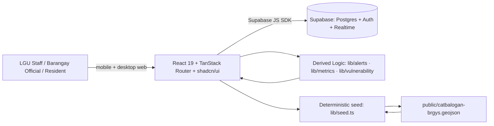

# WellPoint — Solution Architecture

Companion to `docs/plan.md`. This document defines the system shape, the technology choices and why, the data model, the derived logic, and the feasibility/scalability arguments judges will probe. For personas/access control and the end-to-end data flows, see `docs/system-design.md`.

---

## 1. Architecture decision

**WellPoint is a frontend-only web app: a React 19 + TanStack Router + Vite SPA in `frontend/` that talks directly to Supabase (Postgres + Auth + Realtime). There is no separate backend.**

The prototype is a real, working system, not a static demo:

- Community reports persist in a Supabase `reports` table and appear in the alerts view without a page reload (Postgres Realtime).
- Access state, vulnerability tier, alerts, and metrics are **derived client-side** as pure functions in `frontend/src/lib/` from the deterministic seed and the Supabase-backed state.
- The real 57-barangay boundaries of Catbalogan City are served from `frontend/public/catbalogan-brgys.geojson` and rendered with MapLibre.
- Feasibility & Implementability is **40%** of Level 1. We protect it by keeping the system small: one `npm run dev`, a deterministic client-side seed (`baseSeed = 20261006`), and Supabase for persistence and authentication. No NestJS, no Docker, no API keys beyond the Supabase anon key.

The trade-off — derived logic runs in the browser, not a server — is deliberate for this prototype and called out explicitly: every derived function is a pure, testable TypeScript module that can be moved behind an edge function in production without changing its signature.

---

## 2. System diagram



**Supabase is the single source of truth for user-authored data** (`water_sources`, `reports`, `profiles`) and identity (email/password Auth). Everything else — the 57 barangay records, the 5 pilot systems, the derived access states, alerts, and metrics — is computed deterministically in the browser from `frontend/src/lib/`.

> **Production swap:** keep the same domain types and derived functions; move `lib/seed.ts` and `lib/{alerts,metrics,vulnerability}.ts` behind Supabase Edge Functions or a small API for telemetry ingestion (flow meters, PAGASA/DOST feeds), and add multi-LGU scoping. The UI is unchanged.

---

## 3. Technology choices

| Layer | Choice | Rationale |
| :--- | :--- | :--- |
| Frontend framework | React 19 + TanStack Router | Already scaffolded; file-based, type-safe routes. |
| Frontend UI | shadcn/ui (Tailwind CSS v4 + Radix/Base UI) | Accessible, polished components; no heavy UI library. |
| Build tool | Vite 8 | Dev server on port 3000; small production bundle. |
| Database / auth | Supabase (Postgres + Auth + Realtime) | Managed Postgres, email/password auth, realtime subscriptions out of the box. |
| Data access | `@supabase/supabase-js` + `useSyncExternalStore` | One store (`lib/water-store.ts`) syncs `water_sources` and `reports` with debounced `postgres_changes` reloads. |
| Domain types | TypeScript, one file | `frontend/src/data/types.ts` is the single typed contract. |
| Mapping | MapLibre GL (Carto basemaps; `blank` mode for offline) | Real PSGC-coded polygons; tiles degrade to a blank style without Wi-Fi. |
| Simulation | Pure functions + seeded RNG (`mulberry32`) | Deterministic, testable, side-effect free, in `lib/seed.ts`. |
| Lint/format | ESLint + Prettier + `tsc --noEmit` | Green `typecheck` and `build` are submission requirements. |
| Run / deploy | `npm run dev` locally; any static host + Supabase | One command start; near-zero cost; one Supabase project to manage. |

**Explicitly rejected for the prototype:** a separate backend/NestJS API, Docker Compose, an ORM (TypeORM), Zod validation, TanStack Query, a chart library, and a map tile provider key. The derived logic is plain TypeScript — no framework — so it is trivially portable.

---

## 4. Data model

The domain model is defined once in **`frontend/src/data/types.ts`**. User-authored records live in Supabase tables; static and derived values are computed client-side. Field names are stable — seed, store, derived logic, and UI all depend on them.

```ts
type Role = 'citizen' | 'official' | 'lgu' | 'drrm'
type AssetKind = 'pump' | 'well' | 'reservoir' | 'station'
type SourceStatus = 'ok' | 'low' | 'empty' | 'repair' | 'unsafe'

type Asset = {                  // "water_sources" table in Supabase
  id: string
  kind: AssetKind
  name: string
  lng: number
  lat: number
  status: SourceStatus
  barangayPsgc: string          // FK → barangays.psgc_code
  systemId: string              // FK → water_systems.id (nullable)
}

type WaterSystem = {           // "water_systems" table in Supabase (5 pilots)
  id: string                   // fixed UUID, matches the deterministic flow series
  name: string
  level: 'I' | 'II' | 'III'
  barangayId: string           // resolved from barangays.system_id
  serviceHours: number
  operator: string
  affordability: number        // 0-100
  population: number
}

type ServiceStatus = {         // derived per system (lib/derive.ts), never stored
  available: boolean
  flow: number                 // % of nominal (0-100+)
  quality: 'safe' | 'advisory' | 'unsafe'
  reason: 'drought' | 'typhoon' | 'maintenance' | 'contamination' | null
}

type Community = {             // "barangays" table in Supabase (metadata); polygons live in the GeoJSON
  psgcCode: string
  name: string                 // barangay (ADM4_EN)
  areaSqKm: number             // AREA_SQKM from the GeoJSON
  lat: number                  // polygon centroid
  lng: number
  distanceToCenterKm: number   // centroid → Poblacion cluster
  population: number
  affordability: number
  systemId: string             // FK → water_systems.id ('' when no pilot system)
  // accessState and vulnerabilityTier are NOT stored — they are derived (§5).
}

type CommunityReport = {       // "reports" table in Supabase
  id: string
  reporterId: string           // FK → profiles.id
  reporterName: string         // joined from profiles
  barangayPsgc: string         // FK → barangays.psgc_code
  area: string                 // joined name, for display
  type: 'no_water' | 'low_pressure' | 'contamination' | 'infrastructure_damage' | 'other'
  description: string
  status: 'new' | 'acknowledged' | 'resolved'
  createdAt: string
}

type Warning = {               // "warnings" + "warning_barangays" tables (DRRM/LGU-authored)
  id: string
  authorId: string             // FK → profiles.id
  authorName: string
  type: 'outage' | 'contamination' | 'disaster' | 'maintenance' | 'advisory'
  severity: 'info' | 'warning' | 'critical'
  title: string
  message: string
  action: string
  status: 'active' | 'resolved' | 'cancelled'
  barangayPsgcs: string[]      // M:N targets via warning_barangays
  createdAt: string
}

type Alert = {                 // derived (lib/alerts.ts) or merged from warnings — never hand-entered
  id: string
  source: 'derived' | 'authored'
  type: 'shortage' | 'contamination' | 'outage'
  severity: 'info' | 'warning' | 'critical'
  area: string
  systemId?: string
  reportId?: string
  warningId?: string
  raisedAt: string
  status: 'active' | 'resolved'
  reason: string
  message: string
  action: string               // recommended next step, plain language
}
```

### Relationships

- One `Community` (barangay) → at most one `WaterSystem` (via `barangays.system_id`); a system → many `Asset`s (via `water_sources.system_id`).
- An `Asset` also belongs to a barangay (`water_sources.barangay_psgc`), which is how permissions scope by area.
- `Alert`s are **derived** from `ServiceStatus`, `Asset.status`, `CommunityReport`, and each barangay's computed vulnerability — plus **authored** `Warning`s merged into the same read model (tagged `source: 'authored'`).
- `CommunityReport`s and `Warning`s are user-created records **persisted in Supabase** with PSGC-coded FKs.
- `accessState` and `vulnerabilityTier` are **derived read-model values** (§5) — never stored or seeded, which keeps the metric non-circular.

### Seed coverage

`supabase/schema.sql` seeds the **57 barangays of Catbalogan City** (PSGC-coded metadata: area, centroid, distance-from-center, population, affordability) plus the **5 pilot systems** with fixed UUIDs. The deterministic values come from the same formulas as `frontend/src/lib/seed.ts` (`baseSeed = 20261006`). The polygons themselves stay in `frontend/public/catbalogan-brgys.geojson` (served to MapLibre); `barangays` holds metadata, not geometry. If the `barangays`/`water_systems` tables are not yet applied, the client falls back to `lib/seed.ts`. Boundaries are real; water-source coordinates and all water/service inputs are simulated and illustrative.

| Barangay (pilot subset) | Service level | Inputs (simulated) | Initial derived state |
| :--- | :-: | :-: | :--- |
| Poblacion 1 | III | high affordability, low isolation | **secure** |
| San Andres | II | medium affordability | watch |
| Mercedes | II | medium affordability, maintenance event | watch |
| Bangon | I | low affordability, high isolation | watch |
| Canlapwas | I | low affordability, contamination | **critical** (contamination → outage) |

---

## 5. Derived logic (explainable, not black-box)

All three modules are **pure functions** in `frontend/src/lib/` that take the domain state and return read-model values. There is no server: the browser recomputes them whenever the seed or Supabase state changes.

### 5.1 Early-warning alert rules — `frontend/src/lib/alerts.ts`

| Condition | Alert | Severity |
| :--- | :--- | :--- |
| `available === false` | outage | critical |
| `quality === 'unsafe'` | contamination | critical |
| `quality === 'advisory'` | contamination | warning |
| `flow < 25` | shortage | critical |
| `flow < 40` | shortage | warning |
| flow declining over the last 3 ticks **and** `flow < 60` | shortage (early warning) | warning |
| flow declining **and** vulnerability tier high | shortage (early warning, elevated impact) | critical |
| source status `unsafe` | contamination | warning |
| source status `empty` / `repair` (offline) | outage | warning |
| source status `low` | shortage | info |
| report `new` + contamination | contamination | warning |
| report `new` + no_water / infrastructure_damage | outage | warning |
| report `new` + low_pressure | shortage | warning |
| outage/contamination **and** vulnerability tier high | same alert, **priority response** | critical |

Each alert carries a plain-language `message`, a recommended `action` (e.g., "Deploy emergency water to Barangay Canlapwas within 6 hours"), and — for vulnerable barangays — an **impact note** tying the disruption to livelihoods (e.g., "threatens fishing/farming income"). Thresholds are small, documented, and shown in the UI — judges value transparency over a hidden score. Response priority is severity-weighted and underserved-first: same severity, isolated/low-affordability barangays are served first (`sortAlerts`).

### 5.2 Water-security metrics — `frontend/src/lib/metrics.ts`

All access metrics are **derived from current signals, never stored or seeded**, so the score cannot be gamed by its own labels:

- **Access coverage %** = population with a *derived* access state of full or partial ÷ total population. A barangay counts as full-access only if its system is available, flow ≥ 40, quality is safe, and affordability is not low — *covered ≠ accessed*.
- **Reliability %** = population-weighted mean `flow` (unavailable systems count as 0), so outages visibly hurt the score.
- **Affordability** = population-weighted affordability index (0–100).
- **Active alerts** = count of active derived alerts.
- **Water-security score (0–100)** = `0.4·access coverage + 0.3·reliability + 0.3·affordability − penalty`, where `penalty = min(30, 10·critical + 4·warning + 1·info)`.
- **Status band:** ≥ 75 **Secure** (green), 50–74 **Watch** (amber), < 50 **Critical** (red).

The composite score drives the dashboard banner; the components drive the KPI cards, so the user can always see *why* the score is what it is.

### 5.3 Structural vulnerability — `frontend/src/lib/vulnerability.ts`

Vulnerability makes the real GeoJSON *do work*: it is the forward-looking half of the early warning. For each of the 57 barangays, computed from polygon geometry + service inputs:

- `isolation (0–1)` = `0.5·min(1, areaSqKm / 10) + 0.5·min(1, distanceToCenterKm / 15)` — larger, farther-from-city-center barangays (the "geographically isolated" language of the challenge) score higher.
- `structural vulnerability (low / medium / high)` = isolation + service level (`I` is riskiest) + source capacity margin (proxied by affordability). All inputs and thresholds are documented and shown in the drill-down.
- **Use:** weights alert severity (5.1), elevates response priority, and powers the impact note. Because it combines *static* geography with *live* trend, an alert can fire *before* a failure fully hits — the explainable "early warning" claim, not a black box.

---

## 6. Data access contract

There is no REST API. The SPA reads and writes Supabase directly through one store (`frontend/src/lib/water-store.ts`) and one read model (`frontend/src/lib/store.ts`).

| Surface | Shape | Notes |
| :--- | :--- | :--- |
| Supabase table `barangays` | `Community` metadata (57) | read by all; seeded in `supabase/schema.sql` |
| Supabase table `water_systems` | `WaterSystem` (5 pilots) | read by all; fixed UUIDs key the deterministic flow series |
| Supabase table `water_sources` | `Asset` | read by all; writes by `official` (own barangay) + `drrm` (stations) via `can_place()` / `can_set_status()` RLS helpers |
| Supabase table `reports` | `CommunityReport` | insert by `citizen`/`official` (own barangay); triage (acknowledge/resolve) by `official` (own barangay, RLS) |
| Supabase table `warnings` + `warning_barangays` | `Warning` | author by `lgu`/`drrm`; targeted to barangays via M:N join |
| Supabase table `profiles` | `{ name, email, role, barangay_psgc }` | auto-created on signup; `lgu` can update roles/barangays (role management) |
| `useWaterStore()` | `{ role, assets, reports, warnings, barangays, systems, users, disruption, loading, error }` | `useSyncExternalStore` + debounced `postgres_changes` subscriptions |
| `useDomain()` (`lib/store.ts`) | full read model | composes Supabase data + derived alerts/metrics/vulnerability; `barangayDetail()` for drill-down |

Auth is Supabase email/password (`lib/auth.ts`); the `profiles.role` + `profiles.barangay_psgc` rows drive the persona view and scope. Realtime: the store subscribes to `postgres_changes` on `water_sources`, `reports`, `warnings`, and `warning_barangays` with a 300 ms debounce, so a report, status change, or warning shows up without a reload. If Supabase is unreachable (or `barangays`/`water_systems` are not yet applied), the dashboard degrades to an explicit error state and the client-side seed in `lib/seed.ts` still renders.

---

## 7. Production path (documented, not built)

- **Data sources:** LGU water-office records and existing flow meters / service logs; PAGASA rainfall and DOST hazard feeds; barangay reports. Where telemetry is absent, staff enter data manually through the same forms.
- **Telemetry:** a scheduled ingest job (a Supabase Edge Function or an external scheduler) writes `ServiceStatus` samples from meters/PAGASA/DOST; the §5 rules keep running, moved server-side with unchanged signatures.
- **Scoping & auth:** extend Supabase RLS for multi-LGU tenancy; add role management. The UI and derived logic stay unchanged.
- **Deploy:** the SPA on any static host (Vercel/Netlify/VPS) + the existing Supabase project; scale Supabase as records grow.

---

## 8. Feasibility

- **Data:** the prototype ships with real PSGC-coded barangay boundaries for all 57 Catbalogan City barangays (`frontend/public/catbalogan-brgys.geojson`); water data is deterministic simulated data. Real water data would come from LGU records, existing meters, and PAGASA/DOST; manual entry is the fallback and already works through the report form.
- **Infrastructure:** one Supabase project + one static SPA. No special hardware, no GPU, no backend process, no paid API keys beyond Supabase. **Venue day:** the map survives offline via the MapLibre `blank` mode; the rest of the dashboard keeps working without network (the seed is client-side).
- **Skills:** standard tools (React, TypeScript, Supabase/Postgres) — the same stack many LGU IT vendors already use. Runbook: `npm run dev`; press **Reset demo** before a presentation.
- **Cost:** Supabase free tier is enough for the demo; a static host is free to ~PHP 0. No paid APIs used in the prototype.

---

## 9. Scalability & sustainability

- **Multi-LGU:** every record is scoped by LGU/barangay; adding a new LGU means adding records plus that LGU's own GeoJSON boundaries (same loader), not forking the app.
- **Modular features:** dashboard, coverage, alerts, and reports are independent routes and pure modules, adoptable one at a time.
- **Low bandwidth / mobile:** lightweight SPA, mobile-first; the map falls back to `blank` (no tiles) when offline.
- **Maintenance:** standard web stack, one typed domain file (`data/types.ts`), pure derived functions. A new developer can read the data model in one file.
- **Open-source attribution:** see `docs/submission.md` (all dependencies are MIT/Apache/BSD; PostgreSQL/Supabase are open-source; only Open-Meteo is optionally called for the supply outlook and degrades gracefully).

---

## 10. Non-functional requirements

- **Determinism:** the client seed is deterministic (`baseSeed = 20261006`); every fresh load produces identical derived state until the presenter triggers a disruption.
- **Accessibility:** semantic HTML, labeled inputs, status conveyed by icon **and** text (never color alone), tap targets ≥ 44px, WCAG AA contrast.
- **Robustness:** `Reset demo` clears reports, restores `water_sources.status = 'ok'`, and clears the client-side disruption; one active critical alert (Canlapwas) and one resolved alert (Mercedes) are present in the known-good state.
- **Performance:** MapLibre GeoJSON + small payloads keep first paint fast; no chart or tile dependency.
