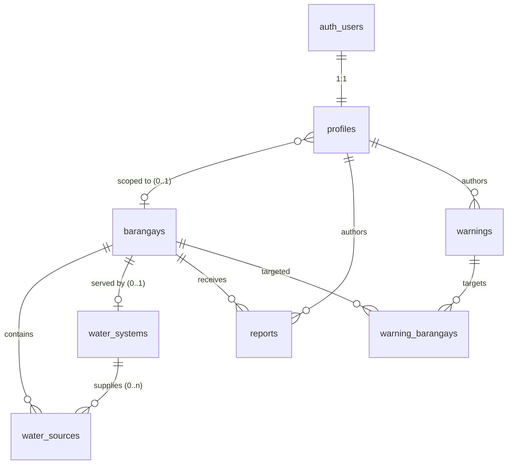

# WellPoint — Revision Plan (Supabase-first, permissions-bounded)

Status: **implemented** — schema applied in `supabase/schema.sql`, frontend migrated to
read barangays/systems/reports/warnings from Supabase (with a client-seed fallback),
DRRM warnings, LGU role management, official source registration, and household
availability are all wired. Docs reconciled below.

## 1. Validation of the proposed model

| Proposed change | Verdict | What changes |
| :--- | :--- | :--- |
| Remove the separate backend; only Supabase + SPA (TanStack Router) | ✅ Already true | No change — keep the frontend-only boundary. |
| LGU = super admin: sees everything, acts immediately, prioritizes | ⚠️ Add role management | LGU already reads everything, ack/resolves reports, edits sources, and gets priority-sorted alerts. Add the ability to assign/move users' roles and barangays (`profiles` upsert). |
| Brgy leaders record source / contamination / status / low pressure / availability → LGU sees it on the map | ⚠️ Add source registration | Reports + status already flow to the map/alerts. Add own-barangay source registration for `official`. |
| Members / households see which/where water is available | ⚠️ Add an availability view | Household view exists; promote it to a dedicated "available water near me" surface (own barangay + nearest working sources). |
| DRRM gives early warnings to affected barangays so they can prepare | ❌ New entity | Alerts are derived only. Add an authored `warnings` table + a DRRM warnings flow. |
| Every persona bounded by permissions | ⚠️ Make it real in the DB | Scope by PSGC FK, not free text; extend RLS to cover all capabilities. |

## 2. What was lacking (additions)

1. **`barangays`** — 57 PSGC-coded rows; the join/scope anchor for every table.
2. **`water_systems`** — the 5 pilot systems in Supabase (currently client-seeded).
3. **`warnings` + `warning_barangays`** — DRRM/LGU-authored early warnings, targeted to barangays.
4. **FK scoping** — `profiles.barangay_psgc`, `reports.barangay_psgc` + `reporter_id`, `water_sources.barangay_psgc` + `system_id`.
5. **LGU role management** — an RLS-gated `profiles.role`/`barangay_psgc` upsert path.

## 3. Target data schema & relations



```sql
-- users (managed by Supabase Auth): auth.users.id, email, …

-- 1. Reference data: the 57 barangays
create table public.barangays (
  psgc_code text primary key,
  name text not null,
  area_sqkm numeric not null default 0,
  lat double precision not null,          -- centroid
  lng double precision not null,
  distance_to_center_km numeric not null default 0,
  population integer not null default 0,
  affordability integer not null default 50,   -- 0–100
  system_id uuid null references public.water_systems (id)
);

-- 2. The 5 pilot systems
create table public.water_systems (
  id uuid primary key default gen_random_uuid(),
  name text not null,
  level text not null check (level in ('I','II','III')),
  service_hours integer not null default 12,
  operator text,
  affordability integer not null default 50,
  population integer not null default 0
);

-- 3. Physical water sources (markers)
create table public.water_sources (
  id uuid primary key default gen_random_uuid(),
  kind text not null check (kind in ('pump','well','reservoir','station')),
  name text not null,
  lng double precision not null,
  lat double precision not null,
  status text not null default 'ok' check (status in ('ok','low','empty','repair','unsafe')),
  barangay_psgc text null references public.barangays (psgc_code),
  system_id uuid null references public.water_systems (id),
  created_at timestamptz not null default now()
);

-- 4. Community reports
create table public.reports (
  id uuid primary key default gen_random_uuid(),
  reporter_id uuid not null references public.profiles (id),
  barangay_psgc text not null references public.barangays (psgc_code),
  type text not null check (type in ('no_water','low_pressure','contamination','infrastructure_damage','other')),
  description text,
  status text not null default 'new' check (status in ('new','acknowledged','resolved')),
  created_at timestamptz not null default now()
);

-- 5. DRRM/LGU-authored early warnings
create table public.warnings (
  id uuid primary key default gen_random_uuid(),
  author_id uuid not null references public.profiles (id),
  type text not null check (type in ('outage','contamination','disaster','maintenance','advisory')),
  severity text not null default 'warning' check (severity in ('info','warning','critical')),
  title text not null,
  message text not null,
  action text,
  status text not null default 'active' check (status in ('active','resolved','cancelled')),
  created_at timestamptz not null default now()
);

create table public.warning_barangays (
  warning_id uuid not null references public.warnings (id) on delete cascade,
  barangay_psgc text not null references public.barangays (psgc_code) on delete cascade,
  primary key (warning_id, barangay_psgc)
);

-- 6. Profiles (role + scope)
create table public.profiles (
  id uuid primary key references auth.users (id) on delete cascade,
  name text,
  email text,
  role text not null default 'citizen' check (role in ('citizen','official','lgu','drrm')),
  barangay_psgc text null references public.barangays (psgc_code),
  last_login_at timestamptz
);
```

### Relation summary

| Relation | Cardinality | Meaning |
| :--- | :--- | :--- |
| `auth.users` → `profiles` | 1:1 | identity ↔ app role/scope |
| `profiles` → `barangays` | M:1 (nullable) | an `official`/`citizen` belongs to ≤1 barangay |
| `barangays` → `water_systems` | 1:0..1 | a pilot barangay is served by one system |
| `water_systems` → `water_sources` | 1:0..n | a system has many sources |
| `barangays` → `water_sources` | 1:0..n | sources sit inside a barangay |
| `profiles` → `reports` | 1:0..n | report authors |
| `barangays` → `reports` | 1:0..n | reports target a barangay |
| `profiles` → `warnings` | 1:0..n | warning authors |
| `warnings` ↔ `barangays` | M:N | a warning targets many barangays |

## 4. Permissions (RLS) matrix

Helpers: `user_role()`, `user_barangay()` (the caller's `barangay_psgc`), `own_barangay(psgc)`.

| Capability | `lgu` | `official` | `citizen` | `drrm` |
| :--- | :-: | :-: | :-: | :-: |
| Read all water data | ✅ | own barangay | own barangay (availability only) | ✅ |
| Register a water source | ✅ | own barangay | — | station only |
| Set source status | ✅ all | pump/well (own) | — | station only |
| Submit report | ✅ | own barangay | — | — |
| Ack / resolve report | ✅ | own barangay | — | — |
| Author warning | ✅ | — | — | ✅ |
| Resolve / cancel warning | ✅ | — | — | own warnings |
| Assign roles / barangays | ✅ | — | — | — |
| Simulate / reset demo | ✅ | — | — | ✅ |

Implementation note: `water_sources` insert for `official` is gated by
`can_place(kind) AND own_barangay(barangay_psgc)`; `reports` insert forces
`barangay_psgc = user_barangay()` (never trust client-sent scope); `warnings`
insert is `user_role() in ('lgu','drrm')`.

## 5. Implementation plan

**Phase 0 — Schema & seed (this artifact)**
- Apply the schema above in `supabase/schema.sql` (drop the old asset-based `reports`, add `barangay_psgc` FKs, add `warnings`).
- Seed `barangays` (57 rows) and `water_systems` (5 rows) with the same deterministic formulas as the current `lib/seed.ts`; generate the 57 INSERT rows from `seed-data/catbalogan-brgys.geojson`.

**Phase 1 — Client reads from Supabase**
- Replace `lib/seed.ts` static arrays with a `barangays` + `water_systems` fetch (keep the GeoJSON file only for map geometry).
- Keep `lib/{vulnerability,alerts,metrics}.ts` as pure derived functions reading the Supabase-backed read model.

**Phase 2 — Permissions**
- Port the RLS matrix; migrate `reports`/`water_sources` to `barangay_psgc`; update `lib/auth.ts` to read `barangay_psgc`.

**Phase 3 — Official source registration + availability**
- Allow `official` to register/set-status on own-barangay sources; verify reflection on the map.

**Phase 4 — DRRM warnings**
- `warnings` CRUD + a "Issue warning" form (targeted barangay multi-select); merge authored warnings into the alerts read model (tag `source: 'authored'`).

**Phase 5 — Household "available water"**
- Citizen-facing "available water near me" view (own barangay + nearest working sources), read-only.

**Phase 6 — LGU role management**
- LGU-only "Users & roles" view: assign `official`/`drrm`, set their barangay.

**Phase 7 — Docs + QA**
- Reconcile `docs/architecture.md` §4/§6, `docs/system-design.md` Part 1, and `supabase/schema.sql`; run `typecheck` + `build` + a fresh-seed smoke test.

## 6. Out of scope (unchanged)

- No separate backend — Supabase (Postgres + Auth + Realtime + RLS) is the data tier.
- Derived logic stays client-side pure functions (portable to Edge Functions later).
- Map geometry stays in `public/catbalogan-brgys.geojson`; `barangays` holds metadata, not polygons.
