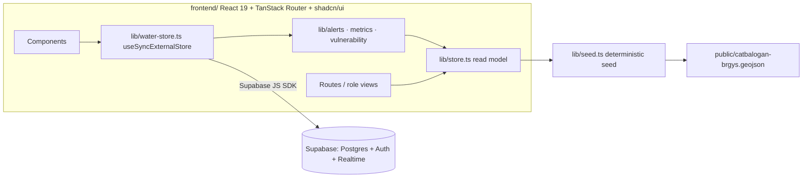
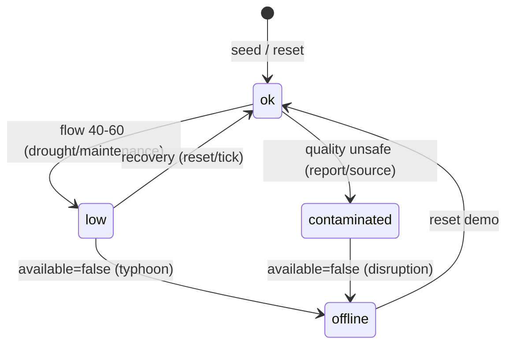
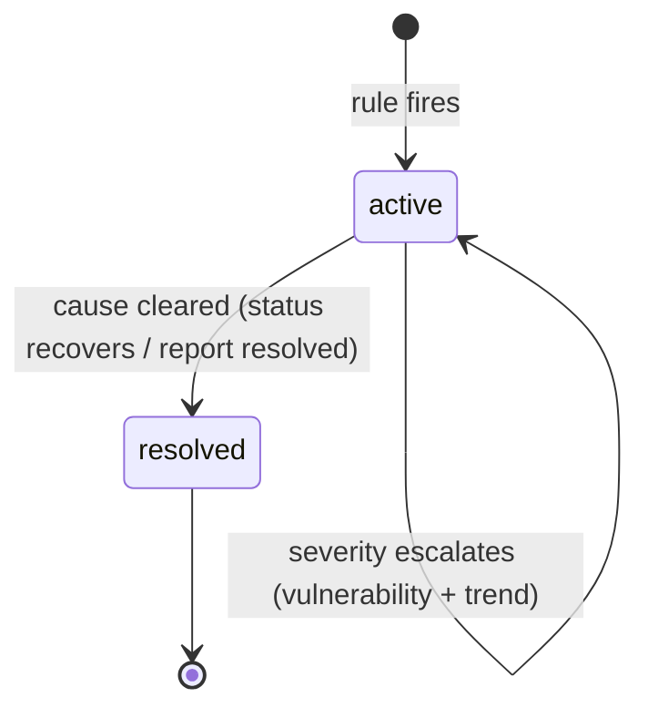
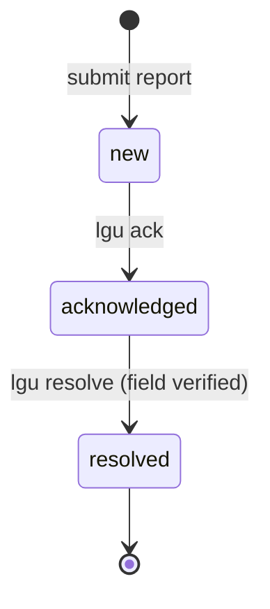

# WellPoint — Technical Design Details

Companion to `docs/plan.md` and `docs/architecture.md`. This document has two parts:

1. **Persona Matrix & Access Control** — who uses the system, what they can do, and what is enforced.
2. **System Logic & Data Flow Architecture** — how information moves end-to-end and which business rules govern each transition.

All names, tables, and rules below are consistent with `docs/architecture.md` (§4 data model, §5 derived logic, §6 data access). Authentication is real (Supabase email/password) and the role comes from the `profiles` table; the permission matrix below is enforced today at the presentation layer and in Supabase row-level security, and fully in the documented production path.

---

# Part 1 — Persona Matrix & Access Control

## 1.1 Role model overview

Four personas (from `docs/plan.md` §2) map to four **roles**. Each role has a defined scope of data it can see and a set of actions it can perform.

| # | Persona | Role | Primary goal |
| :-: | :--- | :--- | :--- |
| 1 | LGU Water / Engineering Office Staff | `lgu` | Know at a glance which barangays are secure, at risk, or down; prioritize response |
| 2 | Barangay Official / Community Leader | `official` | Report issues and see their area's status |
| 3 | Household / Community Member | `citizen` | Get a simple answer: is my water available, safe, affordable today? |
| 4 | DRRM / Disaster Officer | `drrm` | Early warning of water disruption; plan emergency water distribution |

### Enforcement model

| Layer | Prototype (now) | Production path (documented) |
| :--- | :--- | :--- |
| UI | Role comes from the Supabase `profiles` table; the dashboard renders that persona's view | Per-route role menus + guard components |
| Data | Supabase row-level security on `water_sources` and `reports` (see `supabase/schema.sql`) | RLS extended for multi-LGU tenancy |
| Derivation | Alerts/metrics/vulnerability are pure client functions; a role cannot mutate them | Same functions moved server-side |

The matrix below is the **contract the production path enforces**; in the prototype, write permissions are enforced by Supabase RLS and read scoping is demonstrated at the presentation layer.

## 1.2 Persona detail

### Persona 1 — LGU Water / Engineering Office Staff (`lgu`)

**Typical actions**
- Read the dashboard banner and KPI cards (coverage, reliability, active alerts, affordability).
- Read the coverage map (57 barangays) and drill into any barangay's trend, vulnerability, alerts, and open reports.
- Read the alerts list; see severity, area, cause, recommended action, and impact note.
- Acknowledge and resolve community reports.
- Run demo controls: `Simulate disruption` (typhoon / drought / contamination / maintenance) and `Reset demo`.

**Permissions (full, within Catbalogan scope)**
- `read:*` — all entities (status, sources, barangays, alerts, metrics, reports).
- `report:ack` / `report:resolve` — transition report lifecycle states.
- `demo:simulate` / `demo:reset` — mutate demo state.
- `alert:*` — derived; read-only here (staff cannot hand-craft alerts).

**Features available**
Dashboard, coverage map + drill-down, alerts list, report triage, demo controls.

### Persona 2 — Barangay Official / Community Leader (`official`)

**Typical actions**
- Submit a report (area, type, description).
- View their own barangay's status and open alerts.
- See whether their report was acknowledged/resolved (feedback loop).

**Permissions (own barangay only)**
- `read:barangay:own` — status, alerts, sources for their own barangay.
- `report:create` — create reports; `type` limited to `no_water / low_pressure / contamination / infrastructure_damage / other`.
- No demo controls; cannot acknowledge/resolve (that is `lgu`).

**Features available**
Report submission form, barangay status card, report history with status badges.

### Persona 3 — Household / Community Member (`citizen`)

**Typical actions**
- Look up their barangay: is water available, safe, and affordable today?
- Read plain-language status, active alerts, and "who to contact / what to do" actions.

**Permissions (read-only, own barangay)**
- `read:barangay:own` — plain-language status and alerts only (no internal metrics, no other barangays).
- No create/update/demo permissions.

**Features available**
Barangay lookup / 5-second status answer, contact/action guidance.

### Persona 4 — DRRM / Disaster Officer (`drrm`)

**Typical actions**
- Read the alerts list with severity and **response priority** (underserved-first ordering).
- Run `Simulate disruption` to rehearse a typhoon/drought scenario.
- Read vulnerability tiers to plan emergency water distribution routes.

**Permissions (read + demo, city-wide)**
- `read:*` — all entities, same read scope as `lgu`.
- `demo:simulate` / `demo:reset` — scenario rehearsal.
- No report mutation, no acknowledge/resolve.

**Features available**
Alerts list (priority-sorted), coverage map with vulnerability overlay, demo controls.

## 1.3 Access control matrix

Legend: ✓ = granted, — = denied. All access is scoped to Catbalogan City data; `own` = only the actor's barangay.

| Capability | `lgu` | `official` | `citizen` | `drrm` |
| :--- | :-: | :-: | :-: | :-: |
| Main screen | full-screen map | map + inbox | map | map + warnings |
| View coverage map | city-wide | own brgy | own brgy | city-wide |
| View vulnerability tiers | ✓ | own brgy | — | ✓ |
| View alerts (notifications) | city-wide | own brgy | own brgy | city-wide |
| View source health | ✓ | own brgy | ✓ (available only) | ✓ |
| Register a water source | — | ✓ (own) | — | station only |
| Set source status | — | ✓ (own) | — | station only |
| Submit report | — | — | ✓ (own) | — |
| Acknowledge / resolve report (inbox) | — | ✓ (own) | — | — |
| Author warning | ✓ | — | — | ✓ |
| Resolve / cancel warning | ✓ | — | — | ✓ (own) |
| Assign roles / barangays | ✓ | — | — | — |
| Run `simulate` / `reset demo` | ✓ | — | — | ✓ |
| Drill-down: trend + vulnerability breakdown | ✓ | own brgy | — | ✓ |

**Production enforcement notes**
- `official` identity is tied to a `profiles.barangay_psgc` so "own barangay" is an entity-level filter, not a string match.
- `lgu` and `drrm` are city-wide roles issued by the LGU admin (stored in `profiles.role`).
- `citizen` submits reports for their own barangay; `official` triages that inbox. `lgu` has no report screen — it sees report-derived alerts city-wide.
- Water-source registration/status is `official` (own barangay) + `drrm` (stations); `lgu` is read-only on sources (oversight via the map and alerts).
- Every role transition (e.g., report ack) re-derives alerts client-side; a role cannot influence derivation by mutating status.

---

# Part 2 — System Logic & Data Flow Architecture

## 2.1 High-level overview

**One sentence:** the browser renders a read model computed from a deterministic client-side seed and the Supabase-backed store (`water_sources`, `reports`, `profiles`); the only write paths are `report:create`, `report:ack/resolve`, `demo:simulate`, and `demo:reset`, and every write triggers a re-derivation that updates the read model in place via Realtime.

## 2.2 Data flow: boot & seed

| Step | Actor | What happens | Business logic |
| :--- | :--- | :--- | :--- |
| 1 | `npm run dev` | Vite serves the SPA on port 3000 | — |
| 2 | `useBarangays()` | Fetches `public/catbalogan-brgys.geojson` (57 features) | PSGC codes are the join key; features outside `ADM3_PCODE = PH0806005` are skipped |
| 3 | `lib/seed.ts` | Builds the 57 `Community` records (area, centroid, distance-to-center, population, affordability) | Deterministic via `mulberry32(BASE_SEED)`; pilot barangays get their system's values |
| 4 | `lib/seed.ts` | Defines the 5 pilot `WaterSystem`s and their 6-tick status history | Deterministic sequence via `baseSeed = 20261006` |
| 5 | `lib/water-store.ts` | Loads `water_sources` + `reports` from Supabase and subscribes to `postgres_changes` | Debounced (300 ms) reload on any change |
| 6 | `lib/store.ts` | Composes seed + store into the read model; derives alerts, metrics, vulnerability | Pure functions; recomputed on any input change |

## 2.3 Data flow: read path (dashboard)

1. Route loads → `useDomain()` mounts (`lib/store.ts`), which composes `useWaterStore()` + `useBarangays()`.
2. `lib/alerts.ts` runs the §5.1 rules against each system's derived status, source statuses, and open reports.
3. `lib/metrics.ts` computes: access coverage (derived access state per barangay), reliability (population-weighted mean flow), affordability index, active-alert count, composite score, status band.
4. `lib/vulnerability.ts` returns the per-barangay tier used for weighting and the impact note.
5. UI renders: banner (status band) → KPI cards (components of the score) → map (polygons + derived color) → alerts (priority-sorted, underserved-first).

**Reactivity contract:** `useWaterStore` is a `useSyncExternalStore`; Supabase Realtime triggers a reload, the store notifies listeners, and the read model recomputes. The browser is the only place scoring runs in the prototype — it renders derived values, never invents state.

## 2.4 Data flow: report submission (write path)

1. `official` submits a report `{ area, type, description }` (the form pins `area` to the selected barangay; production: from the `profiles.barangay`).
2. `lib/water-store.ts` `submitReport` inserts into Supabase `reports` (`status: 'new'`).
3. The insert fires a `postgres_changes` event → the store reloads `reports`.
4. Re-derivation runs: `lib/alerts.ts` re-evaluates — `new` contamination report → contamination warning; `new` no_water / infrastructure_damage → outage warning.
5. The read model updates in place; the new alert appears without a full reload.
6. `lgu` acknowledges (`status: acknowledged`) or resolves (`status: resolved`); resolution re-derives alerts and may resolve the linked alert (see §2.6).

## 2.5 Data flow: demo simulation & reset

1. `simulateDisruption(type, systemId)` sets a client-side `disruption` override on the target system (typhoon → `available:false`; drought → `flow` drop; contamination → `quality:'unsafe'`; maintenance → `available:false`).
2. Re-derivation runs: alert rules now fire against the disrupted status; metrics fall (reliability drops, coverage may drop); vulnerability weighting elevates isolated barangays to `critical` priority.
3. The read model updates in place → the dashboard reacts live.
4. `resetDemo()` clears the disruption, deletes Supabase `reports`, and restores `water_sources.status = 'ok'` → the known-good state returns.

## 2.6 State machines governed by business logic

### ServiceStatus (system health) — derived, never edited in place

Governing rules: an **outage** (`available === false`) is `critical`; **contamination** (`quality unsafe`) is `critical`; `flow < 40` → warning shortage, `< 25` → critical; a **declining trend over 3 ticks** fires the early-warning shortage, and if vulnerability is high it escalates to `critical` and sets `priority response`.

### Alert lifecycle — derived, never hand-entered

Governing rules: an alert resolves only when the triggering condition clears (re-derivation on every write/tick). Resolution of a report may resolve alerts linked by `reportId`.

### CommunityReport lifecycle — the only user-authored state

Governing rules: `official`/`citizen` cannot transition states; only `lgu` can; every transition re-derives alerts.

### Demo state

`known-good` → (simulate) → `disrupted` → (reset) → `known-good`. The client seed is the only writer of `known-good`; `simulate` sets a disruption override; `reset` clears it and re-seeds Supabase state.

## 2.7 Validation & error boundaries

- **Type safety:** a single typed domain (`data/types.ts`); `tsc --noEmit` fails on shape drift.
- **Store:** `useWaterStore` surfaces loading → error → success states; on Supabase failure the UI shows a retry/error card rather than stale/blank data.
- **Derivation is total:** every read-model value is computed from the seed + store; there is no path where the browser invents state.

## 2.8 Rule-to-flow traceability

| Business rule | Lives in | Governs | Verified in flow |
| :--- | :--- | :--- | :--- |
| Access state derived (covered ≠ accessed) | `frontend/src/lib/metrics.ts` (§5.2) | Map color, access-coverage KPI | §2.3 |
| Alert rules + severity | `frontend/src/lib/alerts.ts` (§5.1) | Alert lifecycle, priority | §2.3, §2.4, §2.5 |
| Vulnerability tier (isolation + level + capacity) | `frontend/src/lib/vulnerability.ts` (§5.3) | Alert weighting, impact note, response order | §2.3, §2.5 |
| Report lifecycle transitions | `frontend/src/lib/water-store.ts` | `new → acknowledged → resolved` | §2.4, §2.6 |
| Deterministic demo transitions | `frontend/src/lib/seed.ts` + `water-store.ts` | simulate/reset | §2.5, §2.6 |
| Role-based capability | Supabase RLS (`supabase/schema.sql`) + UI | Access matrix (Part 1) | Part 1 |
