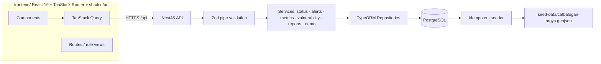
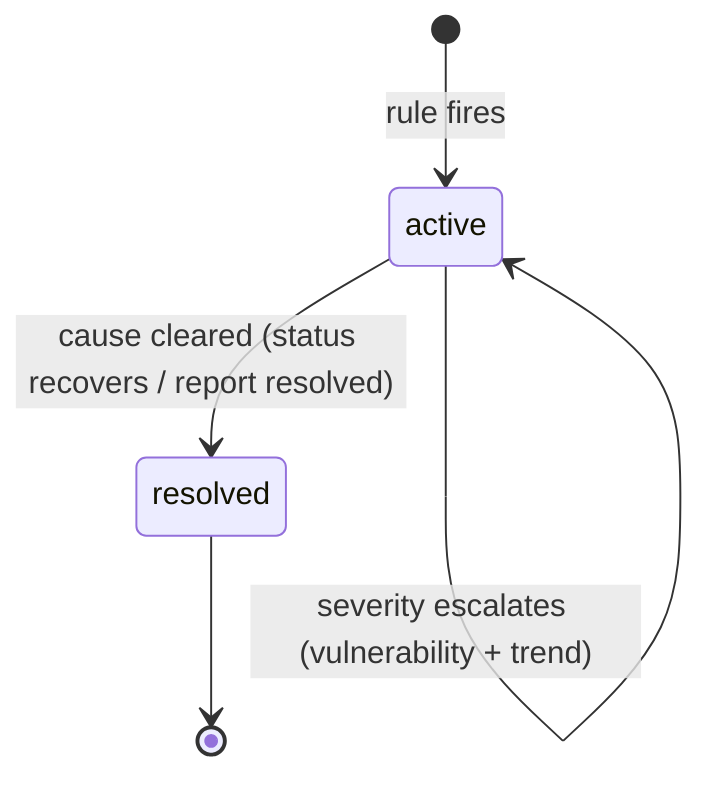
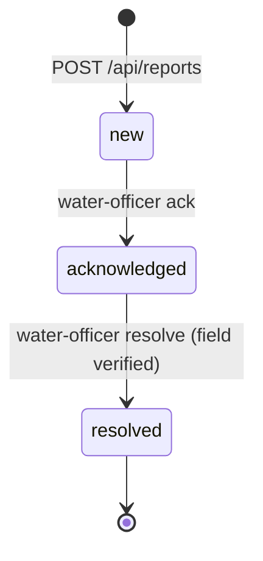

# WellPoint — Technical Design Details

Companion to `docs/plan.md` and `docs/architecture.md`. This document has two parts:

1. **Persona Matrix & Access Control** — who uses the system, what they can do, and what is enforced.
2. **System Logic & Data Flow Architecture** — how information moves end-to-end and which business rules govern each transition.

All names, endpoints, and rules below are consistent with `docs/architecture.md` (§4 entities, §5 derived logic, §6 API contract). Nothing here changes the current scope: the prototype is single-tenant with **no login**; roles below are the design target, demonstrated in the prototype through a role-mode switcher and enforced in the documented production path.

---

# Part 1 — Persona Matrix & Access Control

## 1.1 Role model overview

Four personas (from `docs/plan.md` §2) map to four **roles**. Each role has a defined scope of data it can see and a set of actions it can perform.

| # | Persona | Role | Primary goal |
| :-: | :--- | :--- | :--- |
| 1 | LGU Water / Engineering Office Staff | `water-officer` | Know at a glance which barangays are secure, at risk, or down; prioritize response |
| 2 | Barangay Official / Community Leader | `barangay-official` | Report issues and see their area's status |
| 3 | Household / Community Member | `resident` | Get a simple answer: is my water available, safe, affordable today? |
| 4 | DRRM / Disaster Officer | `drrm-officer` | Early warning of water disruption; plan emergency water distribution |

### Enforcement model

| Layer | Prototype (now) | Production path (documented) |
| :--- | :--- | :--- |
| UI | Role-mode switcher (demo only): any viewer can switch role to see that persona's view; no credentials | Route guards + per-route role menus |
| API | No authentication; every endpoint is callable; Zod validates shape, not identity | NestJS guards (`RolesGuard` + JWT) on controllers; `@Roles()` decorators |
| Data | One shared Postgres instance | Row-level tenant/role scoping on entities |

The matrix below is therefore the **contract the production path enforces**; in the prototype, permissions are demonstrated at the presentation layer.

## 1.2 Persona detail

### Persona 1 — LGU Water / Engineering Office Staff (`water-officer`)

**Typical actions**
- Read the dashboard banner and KPI cards (coverage, reliability, active alerts, affordability).
- Read the coverage map (57 barangays) and drill into any barangay's trend, vulnerability, alerts, and open reports.
- Read the alerts list; see severity, area, cause, recommended action, and impact note.
- Acknowledge and resolve community reports.
- Run demo controls: `Simulate disruption` (typhoon / drought / contamination / maintenance) and `Reset demo`.

**Permissions (full, within Catbalogan scope)**
- `read:*` — all entities (status, sources, barangays, alerts, metrics, reports).
- `report:ack` / `report:resolve` — transition report lifecycle states.
- `demo:simulate` / `demo:reset` — mutate demo state.
- `alert:*` — derived server-side; read-only here (staff cannot hand-craft alerts).

**Features available**
Dashboard, coverage map + drill-down, alerts list, report triage, demo controls.

### Persona 2 — Barangay Official / Community Leader (`barangay-official`)

**Typical actions**
- Submit a report (area auto-set to their barangay, type, description).
- View their own barangay's status and open alerts.
- See whether their report was acknowledged/resolved (feedback loop).

**Permissions (own barangay only)**
- `read:barangay:own` — status, alerts, sources for their own barangay.
- `report:create` — create reports; `type` limited to `no_water / low_pressure / contamination / infrastructure_damage / other`.
- No access to other barangays' data; no demo controls; cannot acknowledge/resolve.

**Features available**
Report submission form, barangay status card, report history with status badges.

### Persona 3 — Household / Community Member (`resident`)

**Typical actions**
- Look up their barangay: is water available, safe, and affordable today?
- Read plain-language status, active alerts, and "who to contact / what to do" actions.

**Permissions (read-only, own barangay)**
- `read:barangay:own` — plain-language status and alerts only (no internal metrics, no other barangays).
- No create/update/demo permissions.

**Features available**
Barangay lookup / 5-second status answer, contact/action guidance.

### Persona 4 — DRRM / Disaster Officer (`drrm-officer`)

**Typical actions**
- Read the alerts list with severity and **response priority** (underserved-first ordering).
- Run `Simulate disruption` to rehearse a typhoon/drought scenario.
- Read vulnerability tiers to plan emergency water distribution routes.

**Permissions (read + demo, city-wide)**
- `read:*` — all entities, same read scope as `water-officer`.
- `demo:simulate` / `demo:reset` — scenario rehearsal.
- No report mutation, no acknowledge/resolve.

**Features available**
Alerts list (priority-sorted), coverage map with vulnerability overlay, demo controls.

## 1.3 Access control matrix

Legend: ✓ = granted, — = denied. All access is scoped to Catbalogan City data; `own` = only the actor's barangay.

| Capability | `water-officer` | `barangay-official` | `resident` | `drrm-officer` |
| :--- | :-: | :-: | :-: | :-: |
| View dashboard KPIs | ✓ | — | — | ✓ |
| View coverage map (57 brgys) | ✓ | own only | own only | ✓ |
| View vulnerability tiers | ✓ | own only | — | ✓ |
| View alerts (city-wide) | ✓ | own only | own only | ✓ |
| View source health | ✓ | own only | — | ✓ |
| View metrics read-model | ✓ | — | — | ✓ |
| Submit report | — | ✓ (own) | — | — |
| Acknowledge / resolve report | ✓ | — | — | — |
| View report history | ✓ (all) | ✓ (own) | — | — |
| Run `simulate disruption` | ✓ | — | — | ✓ |
| Run `reset demo` | ✓ | — | — | ✓ |
| Drill-down: trend + vulnerability breakdown | ✓ | own only | — | ✓ |

**Production enforcement notes**
- `barangay-official` identity is tied to a `Community.psgcCode` so "own barangay" is an entity-level filter, not a string match.
- `water-officer` and `drrm-officer` are city-wide roles issued by the LGU admin.
- `resident` read-only access is served by a public lookup endpoint (`GET /api/barangays/:id/public`) that returns only the plain-language status DTO — no metrics, no internal alerts payloads.
- Every role transition (e.g., report ack) re-derives alerts server-side; a role cannot influence derivation by mutating status.

---

# Part 2 — System Logic & Data Flow Architecture

## 2.1 High-level overview

**One sentence:** the browser renders read-model DTOs fetched through TanStack Query from a NestJS API that derives alerts, metrics, and vulnerability from persisted entities in Postgres; the only write paths are `report:create`, `demo:simulate`, `demo:reset`, and `report:ack`/`resolve`, and every write triggers a server-side re-derivation that invalidates the relevant queries.

## 2.2 Data flow: boot & seed

| Step | Actor | What happens | Business logic |
| :--- | :--- | :--- | :--- |
| 1 | `docker compose up` | Postgres, API, UI start | — |
| 2 | seeder (on API boot) | Reads `seed-data/catbalogan-brgys.geojson` (57 features) | PSGC codes are the join key; features without `ADM4_EN`/`psgc_code` are skipped |
| 3 | seeder | Inserts/updates `Community` (incl. `areaSqKm`, centroid, `distanceToCenterKm`) | Idempotent upsert by `psgcCode`; re-run never duplicates |
| 4 | seeder | Inserts `WaterSource`, `WaterSystem`, and the initial `ServiceStatus` sample series for 5 pilot systems | Deterministic sequence via `baseSeed = 20261006` |
| 5 | seeder | Inserts one active critical alert and one resolved alert | Alerts are still derived (§5.1); the seed only fixes the initial status inputs that produce them |
| 6 | API ready | `GET /api/barangays` etc. begin serving derived read-models | — |

## 2.3 Data flow: read path (dashboard)

1. Route loads → TanStack Query hooks mount (`useStatus()`, `useMetrics()`, `useAlerts()`, `useBarangays()`).
2. Each hook fetches its endpoint; response bodies pass through the shared **Zod schemas** on both sides.
3. `metrics.service` computes: access coverage (derived access state per barangay), reliability (mean `flow`, unavailable = 0), affordability index, active-alert count, composite score, status band.
4. `alerts.service` runs the §5.1 rules against latest `ServiceStatus`, source health, open reports, and each barangay's vulnerability tier.
5. `vulnerability.service` returns the per-barangay tier used for weighting and the impact note.
6. UI renders: banner (status band) → KPI cards (components of the score) → map (polygons + derived color) → alerts (priority-sorted, underserved-first).

**Caching contract:** queries are cached by TanStack Query keyed on endpoint; `staleTime` is short for status/alerts, longer for static barangay polygons. The browser never re-implements scoring — it renders DTOs only.

## 2.4 Data flow: report submission (write path)

1. `barangay-official` submits `POST /api/reports` with `{ area, type, description }`; `area` is pinned to their PSGC barangay (production: from the JWT; prototype: from the role-mode picker).
2. Zod pipe validates shape + `type` enum; 400 on failure with the schema error message.
3. TypeORM inserts `CommunityReport` (`status: 'new'`).
4. The write **triggers re-derivation**: `alerts.service` re-evaluates rules — `new` contamination report → contamination warning; `new` no_water / infrastructure_damage → outage warning.
5. TanStack Query invalidation: `useReports`, `useAlerts`, `useMetrics` re-fetch; the new alert appears without a full reload.
6. `water-officer` acknowledges (`status: acknowledged`) or resolves (`status: resolved`); resolution re-derives alerts and may resolve the linked alert (see §2.6).

## 2.5 Data flow: demo simulation & reset

1. `POST /api/demo/simulate { type: 'typhoon' | 'drought' | 'contamination' | 'maintenance', targetSystemId }`.
2. A deterministic disruption function appends a short series of `ServiceStatus` samples to the target system (e.g., typhoon → `available:false`, `quality:'advisory'` → outage).
3. Re-derivation runs: alert rules now fire against the disrupted samples; metrics fall (reliability drops, access coverage may drop); vulnerability weighting elevates isolated barangays to `critical` priority.
4. Invalidation re-fetches status/alerts/metrics → the dashboard reacts live.
5. `POST /api/demo/reset` re-runs the idempotent seeder → all tables return to the known-good state → queries invalidate → clean demo.

## 2.6 State machines governed by business logic

### ServiceStatus (system health) — appended samples, never edited in place

Governing rules: an **outage** (`available === false`) is `critical`; **contamination** (`quality unsafe`) is `critical`; `flow < 40` → warning shortage, `< 25` → critical; a **declining trend over 3 ticks** fires the early-warning shortage, and if vulnerability is high it escalates to `critical` and sets `priority response`.

### Alert lifecycle — derived, never hand-entered

Governing rules: an alert resolves only when the triggering condition clears (re-derivation on every write/tick). Resolution of a report may resolve alerts linked by `reportId`.

### CommunityReport lifecycle — the only user-authored state

Governing rules: `barangay-official`/`resident` cannot transition states; only `water-officer` can; every transition re-derives alerts.

### Demo state

`known-good` → (simulate) → `disrupted` → (reset) → `known-good`. The seeder is the only writer of `known-good`; `simulate` appends samples; `reset` truncates and re-seeds.

## 2.7 Validation & error boundaries

- **Request validation:** NestJS Zod pipe (`ValidationPipe` using `zod` schemas) rejects malformed bodies with field-level messages.
- **Response validation:** shared schemas parse every DTO the API returns; a schema drift fails loudly in development, never silently at the venue.
- **Query layer:** TanStack Query surfaces loading → error → success states; on API failure the UI shows a retry card rather than stale/blank data.
- **Derivation is total:** every read-model is computed from persisted inputs; there is no path where the browser invents state.

## 2.8 Rule-to-flow traceability

| Business rule | Lives in | Governs | Verified in flow |
| :--- | :--- | :--- | :--- |
| Access state derived (covered ≠ accessed) | `metrics.service` (§5.2) | Map color, access-coverage KPI | §2.3 |
| Alert rules + severity | `alerts.service` (§5.1) | Alert lifecycle, priority | §2.3, §2.4, §2.5 |
| Vulnerability tier (isolation + level + capacity) | `vulnerability.service` (§5.3) | Alert weighting, impact note, response order | §2.3, §2.5 |
| Report lifecycle transitions | `reports.service` | `new → acknowledged → resolved` | §2.4, §2.6 |
| Deterministic demo transitions | `demo.service` + seeder | simulate/reset | §2.5, §2.6 |
| Role-based capability | production `RolesGuard` | Access matrix (Part 1) | production only |
